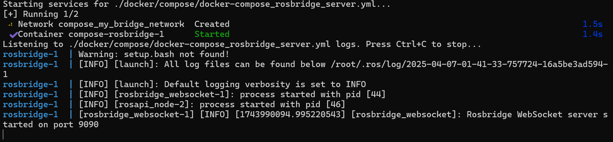

# ROS2_Android_sensor_server


This project is a modified version of [SensorServer by Umer Farooq](https://github.com/umer0586/SensorServer).  
The modifications enable an Android device to send sensor data directly to rosbridge, integrating it with ROS-based systems.


## Features
- **Real-time Sensor Data:**  
  Stream data from various sensors (e.g., accelerometer, gyroscope, GPS, stepCounter.).


- **ROSBridge Integration:**  
  Advertise ROS topics and publish sensor data directly to rosbridge, facilitating integration with ROS-based systems.

## How to Use

1. **Start the rosbridge Server**

    Clone the repository and run the rosbridge server:
    
    ```bash
    git clone https://github.com/screamlab/pros_app.git
    cd pros_app
    ./rosbridge_server.sh
    ```

    

2. **Establish WebSocket Connection**

    Open the app and enter the IP address of your rosbridge server in the designated input box.

    

3. **View Data with Foxglove**

    Download and open [Foxglove](https://foxglove.dev/) to visualize the sensor data.

    

## License

This project is forked from [SensorServer](https://github.com/umer0586/SensorServer) by Umer Farooq and is distributed under the same license as the original project, the GPL-3.0 license. Please see the [LICENSE](LICENSE) file for details.


## Intended Use

This project is intended for academic research and educational purposes only.  

For further inquiries or additional information, please contact me at [ocar8951@gmail.com](mailto:ocar8951@gmail.com).
